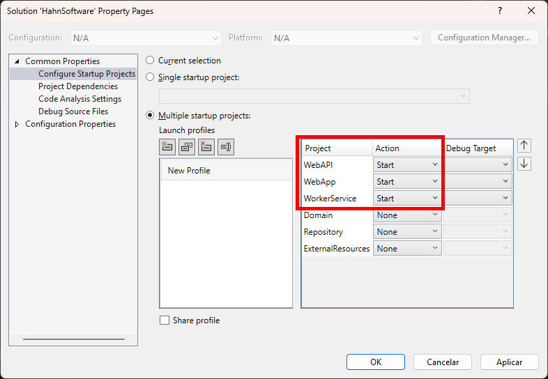
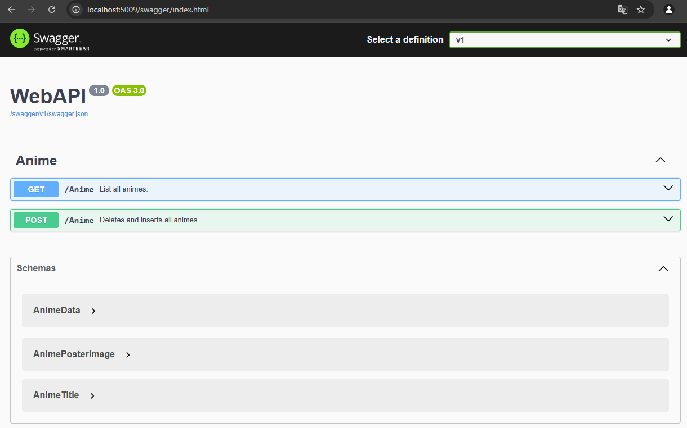
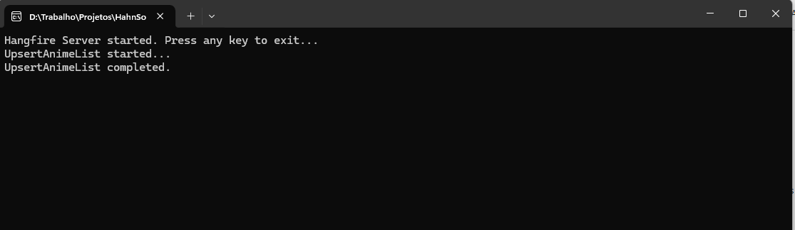
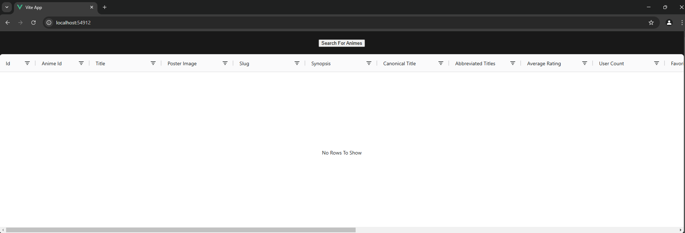
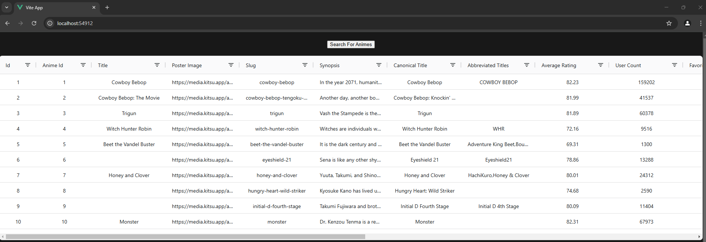
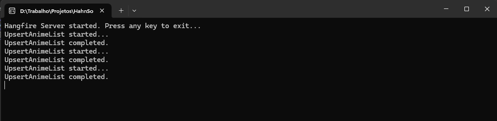
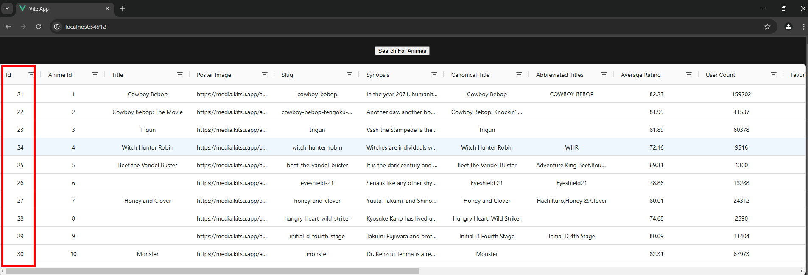
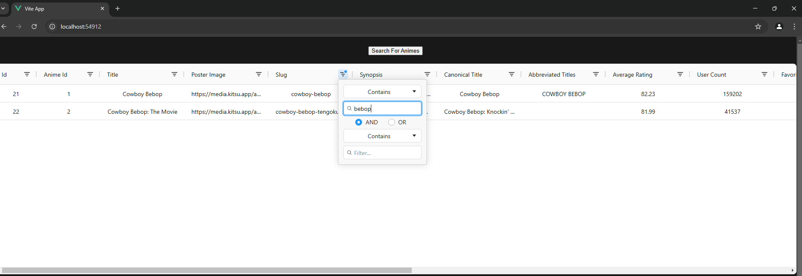

## Anime List
This solution involves Api, App and Service to collect and list animes.

### Environment
- Windows 11
- Visual Studio 17.12.4
- Microsoft Sql Server Management Studio 19.3.4.0

### Solution
- Web API: Has endpoints responsibles for upserting (delete + insert) and listing animes.
- Web App: allows searching for the anime list and filtering the result.
- Worker Service: periodically searches for the anime list from the external repository and saves it into the local database.

### Create Database 
Rebuild the solution, open the terminal in the root directory and run the commands below:

- Create migration files.
```sql
dotnet ef migrations add InitialCreate --project Repository --startup-project WebAPI -- "Server=(localdb)\\mssqllocaldb;Database=HahnSoftwareDatabase;Trusted_Connection=True;";
```

- Create the database and migrations.
```sql
dotnet ef database update --project Repository --startup-project WebAPI -- "Server=(localdb)\\mssqllocaldb;Database=HahnSoftwareDatabase;Trusted_Connection=True;";
```

### Test Run
On the solution properties, set the WebAPI, WebApp and WorkerService to start together.



Run the solution.

### Evidences

#### Web API
The Web API swagger will open but won't be used:



#### Worker Service
Wait for the "UpsertAnimeList" operation to be completed before testing the Web App.



#### Web APP

The inital state has no content in the table:



After clicking the "Search for Animes" button, this will be the expected result:



When the Worker Service runs many times, the auto-generated ids will be changed in the "Id" column:




Example of results being filtered:



This concludes the manual test.